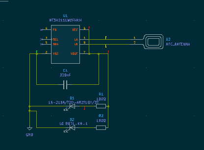
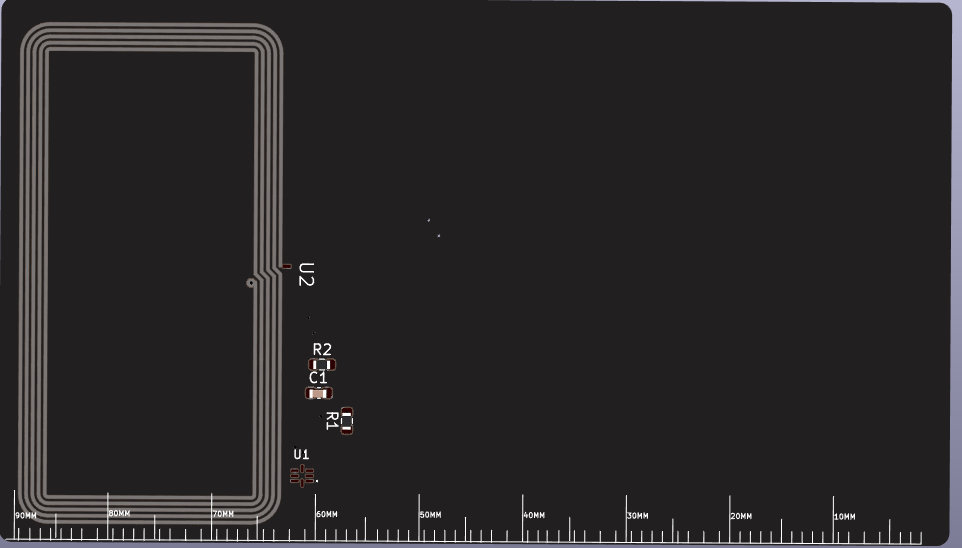

| Date started: July 27, 2025

Total hours spent: 3 hours

# Entry #0 - 07-07-25

The only entry I have in this project lol. Anyways, I finished up the schematic and PCB following this tutorial: https://jams.hackclub.com/jam/hacker-card.

The best part about this thing is probably the silkscreen design.

Here's the full project

I'm excited to start using this project!